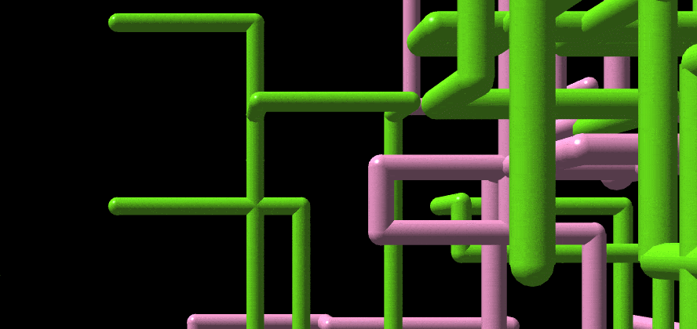

# [ Pipes](https://1j01.github.io/pipes/)

A web-based remake of the Windows 3D Pipes screensaver (3D Pipes.scr or sspipes.scr) using [Three.js](https://threejs.org/)

Includes both [Utah Teapots](https://en.wikipedia.org/wiki/Utah_teapot) and candy cane easter eggs! (with increased chances 😏)

[Check it out!](https://1j01.github.io/pipes/)

## TODO

* Expose options in the UI (and save to local storage)

* Handle different joint options (currectly only does "mixed", which is the best option anyways)

* Better elbow joints (currently uses a sphere (smaller than the ball joint so it doesn't stick out) rather than a section of a torus);
could use [spline extrusion](https://threejs.org/examples/#webgl_geometry_extrude_splines) rather than trying to align a torus section every which way

* Investigate pipe behaviors.
Long pipes, following other pipes, short winding pipes?
Avoiding intersection?
Where's the source code to the original pipes screensaver?
If I [google](https://www.google.com/search?q=original+pipes+screensaver+source+code) "original pipes screensaver source code" I get...
[an HN post about this very project](https://news.ycombinator.com/item?id=10609822) as the top result 😛

* Ball joint at the start of a pipe

* Use a disolve effect when clearing

## See Also

* [98: a recreation of the Windows 98 desktop](https://github.com/1j01/98)

* [NW Screensaver: a platform for running web pages as screensavers](https://github.com/1j01/nw-screensaver)
